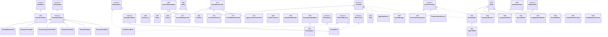

# Inheritance & interfaces

[← index](README.md)

51 types in project-internal inheritance / implementation. Unity bases (MonoBehaviour, ScriptableObject) are stereotypes.

```mermaid
classDiagram
  direction TB
  class AggressiveEnemyProfile {
    <<SO>>
  }
  class Boid {
    <<MB>>
  }
  class Bullet {
    <<MB>>
    <<abstract>>
  }
  class CheckPointItem {
    <<MB>>
  }
  class CollectableItemBase {
    <<MB>>
    <<abstract>>
  }
  class Enemy {
    <<MB>>
  }
  class EnemyAgent {
    <<MB>>
  }
  class EnemyAttackState {
  }
  class EnemyBaseProfile {
    <<SO>>
    <<abstract>>
  }
  class EnemyBrain {
  }
  class EnemyBrainBase {
    <<abstract>>
  }
  class EnemyFleeState {
  }
  class EnemyFollowState {
  }
  class EnemyKillTracker {
    <<MB>>
  }
  class EnemyLoot {
    <<MB>>
  }
  class EnemyNavAgentBase {
    <<MB>>
    <<abstract>>
  }
  class EnemyPrepareAttackState {
  }
  class EnemySearchState {
  }
  class EnemyStateBase {
    <<abstract>>
  }
  class EnemyWanderState {
  }
  class Entity {
    <<MB>>
    <<abstract>>
  }
  class EntityDeathHandler {
    <<MB>>
  }
  class EntityHealth {
    <<MB>>
  }
  class FeatureUnlockService {
  }
  class FriendlyEnemyProfile {
    <<SO>>
  }
  class GranadeBullet {
    <<MB>>
  }
  class GrapplingHookBullet {
    <<MB>>
  }
  class IBrainAttack {
    <<interface>>
  }
  class IBrainHitReaction {
    <<interface>>
  }
  class IBrainVision {
    <<interface>>
  }
  class IEnemyBrain {
    <<interface>>
  }
  class IEnemyState {
    <<interface>>
  }
  class IEntityHealth {
    <<interface>>
  }
  class IItemEffect {
    <<interface>>
  }
  class IPoolable {
    <<interface>>
  }
  class ISaveParticipant {
    <<interface>>
  }
  class ItemDrop {
    <<MB>>
  }
  class LinearPatrolBrain {
  }
  class LinearPatrolProfile {
    <<SO>>
  }
  class NormalBullet {
    <<MB>>
  }
  class NotificationView {
    <<MB>>
    <<abstract>>
  }
  class OneTimePickupTracker {
    <<MB>>
  }
  class Player {
    <<MB>>
  }
  class PlayerHealth {
    <<MB>>
  }
  class QuestManager {
    <<MB>>
  }
  class ScaredEnemyProfile {
    <<SO>>
  }
  class ShelleController {
    <<MB>>
  }
  class StackNotificationView {
    <<MB>>
  }
  class ToastNotificationView {
    <<MB>>
  }
  class TranquilizerBullet {
    <<MB>>
  }
  class UpgradeService {
  }
  EnemyBaseProfile <|-- AggressiveEnemyProfile
  IPoolable <|.. Boid
  IItemEffect <|.. CheckPointItem
  Entity <|-- Enemy
  EnemyNavAgentBase <|-- EnemyAgent
  EnemyStateBase <|-- EnemyAttackState
  EnemyBrainBase <|-- EnemyBrain
  IBrainVision <|.. EnemyBrain
  IBrainAttack <|.. EnemyBrain
  IBrainHitReaction <|.. EnemyBrain
  IEnemyBrain <|.. EnemyBrainBase
  EnemyStateBase <|-- EnemyFleeState
  EnemyStateBase <|-- EnemyFollowState
  ISaveParticipant <|.. EnemyKillTracker
  CollectableItemBase <|-- EnemyLoot
  IPoolable <|.. EnemyNavAgentBase
  EnemyStateBase <|-- EnemyPrepareAttackState
  EnemyStateBase <|-- EnemySearchState
  IEnemyState <|.. EnemyStateBase
  EnemyStateBase <|-- EnemyWanderState
  IPoolable <|.. EntityDeathHandler
  IEntityHealth <|.. EntityHealth
  IPoolable <|.. EntityHealth
  ISaveParticipant <|.. FeatureUnlockService
  EnemyBaseProfile <|-- FriendlyEnemyProfile
  Bullet <|-- GranadeBullet
  Bullet <|-- GrapplingHookBullet
  CollectableItemBase <|-- ItemDrop
  IPoolable <|.. ItemDrop
  IEnemyBrain <|.. LinearPatrolBrain
  IBrainHitReaction <|.. LinearPatrolBrain
  EnemyBaseProfile <|-- LinearPatrolProfile
  Bullet <|-- NormalBullet
  ISaveParticipant <|.. OneTimePickupTracker
  Entity <|-- Player
  EntityHealth <|-- PlayerHealth
  ISaveParticipant <|.. QuestManager
  EnemyBaseProfile <|-- ScaredEnemyProfile
  IPoolable <|.. ShelleController
  NotificationView <|-- StackNotificationView
  NotificationView <|-- ToastNotificationView
  Bullet <|-- TranquilizerBullet
  ISaveParticipant <|.. UpgradeService
```
